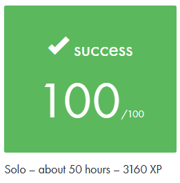

*This project has been created as part of the 42 curriculum by canguyen.*  

# Description
This project is about practicing network configuration. An interface is provided to configure fake small-scale networks. 

# Instructions
## How to run the training interface?
1) Download the `net_practice.tgz` file if you have access to 42 intranet
2) Extract the files using for instance `tar -xzf net_practice.tgz`
3) Run the `index.html` file in your browser (avoid Firefox)
4) To train on the 10 levels, enter your login in the field and you can start netpracticing!
5) Once a level is done, you can clcik the `Get my config` button to export your configuration.  
I had to do that for **submission requirements** for the 10 levels.

## Submission details
You have access in this repo to my 10 exported configuration files. 

# Resources
- [Introduction videos to networking](https://www.youtube.com/playlist?list=PLIhvC56v63IKrRHh3gvZZBAGvsvOhwrRF)
- [An interesting article](https://www.gibbontech.com/fr/ecole42/netpractice/index.html)  
- AI was used in this project to better understand the previous resources. I asked questions such as: what is the purpose of subnetworks?

## Some definitions
### TCP/IP addressing
How IP addresses are structured and assigned to devices on a network

### Subnet mask
Determines which part of an IP address identifies the network and which part the host

### Default gateway
Adresss of the router used when a device needs to communicate outside its local network 

### Routers
Devices that route traffic between different networks

### Switches
Devices that connect devices in the same local network

### OSI layers 
7-layer model describing how data travels through a network, from physical cables (first layer) to applications like browsers (last layer)